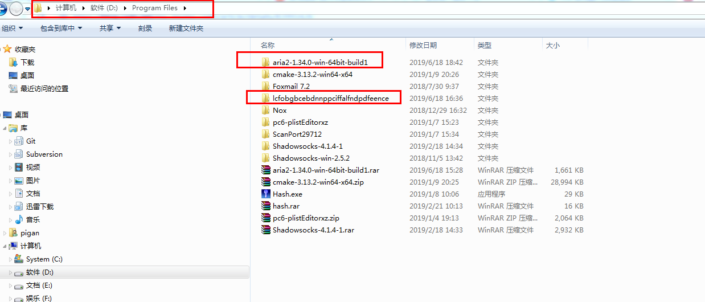
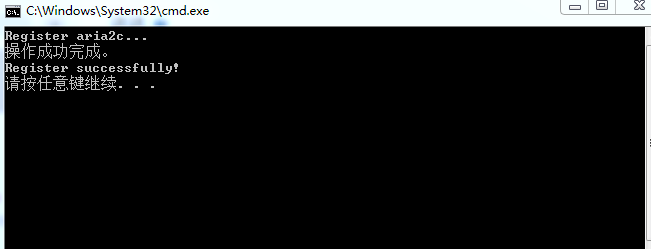
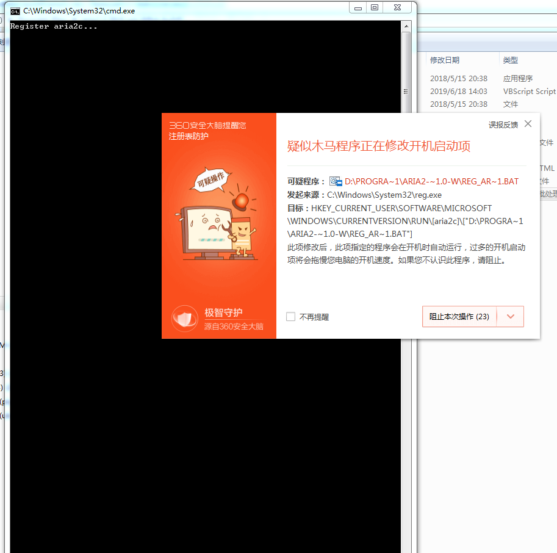
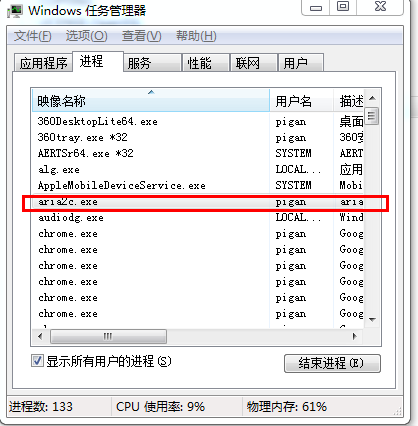
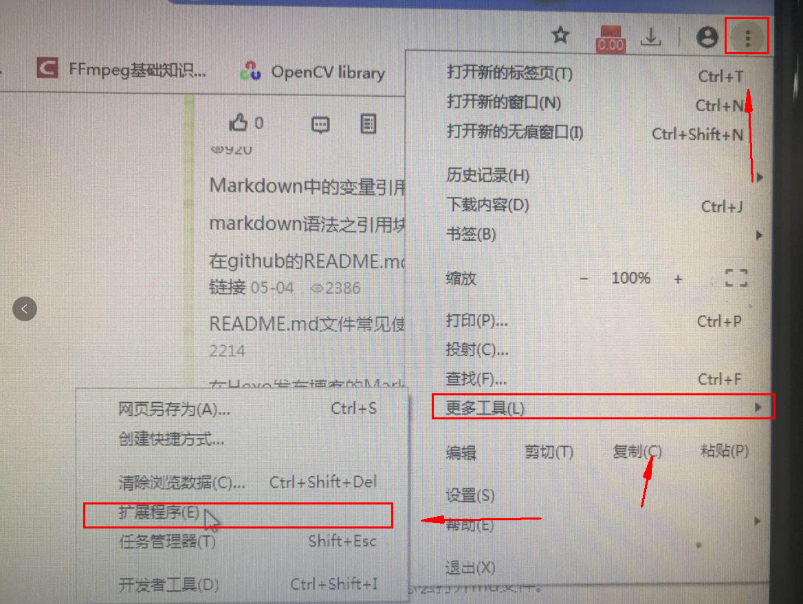
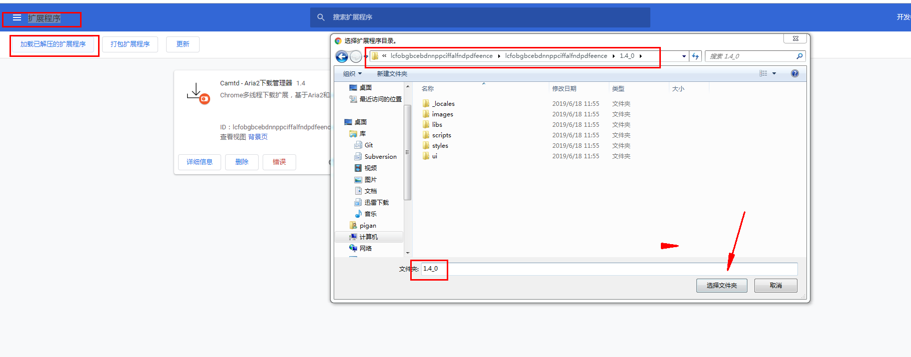

Camtd 是一个很好用的让chrome浏览器支持多线程下载的工具。  
这里只是把安装这个工具的资源做了一个整合，和提供了一个自动注册开机脚本的功能，并未对资源做任何修改。  
* 资源说明：  
** lcfobgbcebdnnppciffalfndpdfeence   
资源来源：https://chrome.google.com/webstore/detail/camtd-aria2-download-mana/lcfobgbcebdnnppciffalfndpdfeence?utm_source=chrome-ntp-icon  
** aria2-1.34.0-win-64bit-build1  
资源来源：https://aria2.github.io/  
* 安装步骤：  
1. 下载资源后，将其放在 D:\Program Files （这只个示例，你想放哪就放哪吧）目录下，如下图：  
  
2. 放好后进入 aria2-1.34.0-win-64bit-build1 目录，点击 reg_aria2c.bat 两次，  
第一次执行为注册相关命令到系统，使其能开机自启动。执行结果如下  
  
如果在执行过程中被360阻止了，请允许该脚本操作，不然会执行失败的  
  
第二次执行时，会一闪而过，之后可以用任务管理器，查看到多了一个aria2c.exe的进程  
  
3. 打开chrome浏览器，进入到扩展程序管理页面中，进入步骤如下：  
  
4. 然后点击加载已解压的扩展程序，按这图操作一下，  
  
5. 安装成功后，在这个页面会有这么个提示：  
  

